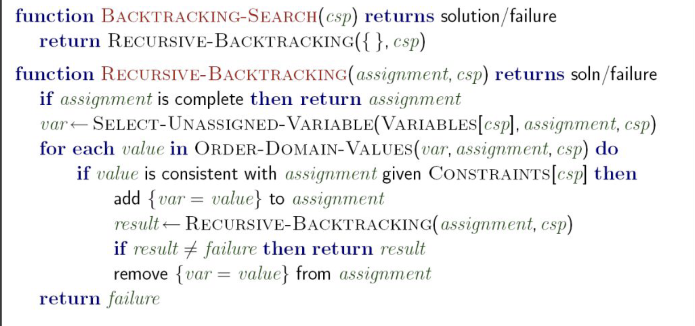

---
tags:
  - CompSci/AI/Agent/Search/Constraints
---
# Backtracking Search
### Description:
- The basic uninformed algorithm for solving CSPs
- We can use [[#Filtering]], [[#Arc Consistency]], [[#Ordering with new heuristics]] and [[#Structure exploiration]] to improve search
### To form the search tree:
- Idea 1: **One variable at a time**
	- Variable assignment can be commutative so no ordering, ex: A = Red, B = Blue can be switched
	- Only need to consider assignments to a single variable at each step
- Idea 2: **Check constraints as you go**
	- Only consider the assignments that **doesnt conflict with all the previous assignments**
	- ie, "Incremental goal test"
- Therefore, each states has child states as possible assignments
	- 
- [[Depth First Search|DFS]] with these 2 ideas are called [[Backtracking Search]]
- 

### Filtering:
- Help detects inevitable failure early
- **Forward Checking**:
	- 
		- if we assign WA to red, then NT and SA cant be red
		- If we assign G to green then NT and NSW and SA cant be green
		- But SA and NT cant both be blue -> terminate G to green (constraint propagation)
	- Propagates information from assigned to unassigned variables, but doesn't provide early detection for all failures
	- **Constrant Propagation**: reason from constraint to constrant
### Arc Consistency:
- $O(n^2d^3)$ can be reduced to $O(n^2d^2)$
- An arc X → Y is consistent **iff** for every value x there is **some** allowed value of y
- If it is violating, **delete from the tail** (the "from" node)
- If X loses a value, neighbors of X need to be rechecked!
- Therefore, detect failture faster than [[#Filtering]]
- The Entire CSP is arc consistency if every arcs are consistent
- Can be run as a preprocessor or after each assignment  
- Limitation:
	- Can have 1 solution left after
	- Can also have multiple solution
	- Can have no solution but not knowing it
		- ex: A=R/B, B=R/B, C=R/B while ABC are connected
		- because they are only checked between 2 nodes at a time
### K-consistency:
- 1-consistency: a node meets its own unary requirements
- 2-consistency: any 2 nodes are consistence, [[#Arc Consistency]]
- 3-consistency: path consistency
- **k-consistency**: any k-nodes are consistence
	- more k -> more expensive to compute
	- k-consistency also mean that k-1, k-2,k-3,... are also consistence
### Ordering with new heuristics:
- Minimum Remaining Values (MRV) **as a [[Heuristic Function|heuristic]]**:
	- Which variable should be assigned next? (MRV)
	- Choose the variable with the fewest legal values left in its domain
		- "most constrained variable"
	- if it gonna fail, **reach failure faster**
- Least Constrining Value as a [[Heuristic Function|heuristic]]:
	- What order should the values be tried? (LCV)
	- Determine which value has the least constraint
	- pick the value with the least so there is more options for other variables
	- Takes more computation
	- Increase likeliness of having solution
	- 1 value is less constrained than another by rerunning [[#Filtering]] 
### Structure exploiration:
- Can we exploit the problem structure?
- Independent subproblems:
	- break big problem to subproblem -> exponentially faster
- **As a tree-struc**:
	- [[Tree Search]], $O(nd^2)$
	- Always work