# Waterfall model
### Description:
- Heavyweight software development process
- Cost of defects is exponentially more expensive as the phrase goes on
- 

```mermaid
gantt
    title Waterfall Model
    dateFormat X
    axisFormat %s
        Feasibility study          :0,1
        Requirements    :1,2
        System design: 2,3
        Program design: 3,4
        Implementation(coding): 4,5
        Program testing:5,6
        Acceptance & Release:6,7
        Operation & maintenance:7,8
```

- Advantages:
	- Process visibility
	- Separation of tasks
	- Quality control at each step
	- Cost monitoring at each step
- Disadvantages: 
- In practice, each stage in the process reveals new understanding of the previous stages, which often requires the earlier stages to be revised.
### Shift left:
- Quality assurance cant be done until the end of the process
- Auality assurance (QA) can be integrated into the development process earlier in the cycle, without requiring the creation of formal documents or deliverables after each step. 
- This can help to identify and fix defects early on, which can save time and money in the long run.
### Modified waterfall model:
- Waterfall model with feed back at each stage
- A fine choice when requirements are well-understood and system design is fixed  
	- Automating manual data processing systems (e.g. utility billing)  
	- New version of system whose functionality derives from earlier product (e.g. embedded controller)  
	- Self-contained components/services with a pre-defined interface  
- Widely recommended for safety-critical or highly regulated systems  
	- Requirements must be thoroughly analyzed and documented