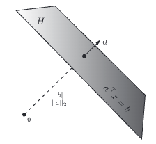

---
tags:
  - Math/linear/vector
---
# Hyperplane
### Description:
- A hyperplane in $\mathbb R^n$ is a set of vectors of the form $H=\{x\in \mathbb R^n\ : \ a^Tx=b\}$
	- where $a\in \mathbb R^n, a\not =0$, and $b\in \mathbb R$ is given
	-  
	- <iframe src="https://www.geogebra.org/3d/n82bytcw?embed" width="800" height="400" allowfullscreen style="border: 1px solid #e4e4e4;border-radius: 4px;" frameborder="0"></iframe>
- We can also think of hyperplanes as the level sets of [[Linear Function]]
- When $b=0$, the hyperplane is simply the set of points that are orthogonal to $a$
	- ie, $H$ is a $n-1$ dimensional [[Subspace]]
- The hyperplane then separates the whole vector space into 2 regions:
	- $H_{--}=\{x\ : \ a^Tx\le b  \}, \ \ H_{++}=\{x\ : \ a^Tx> b  \}$ 
- These regions are called halfspace